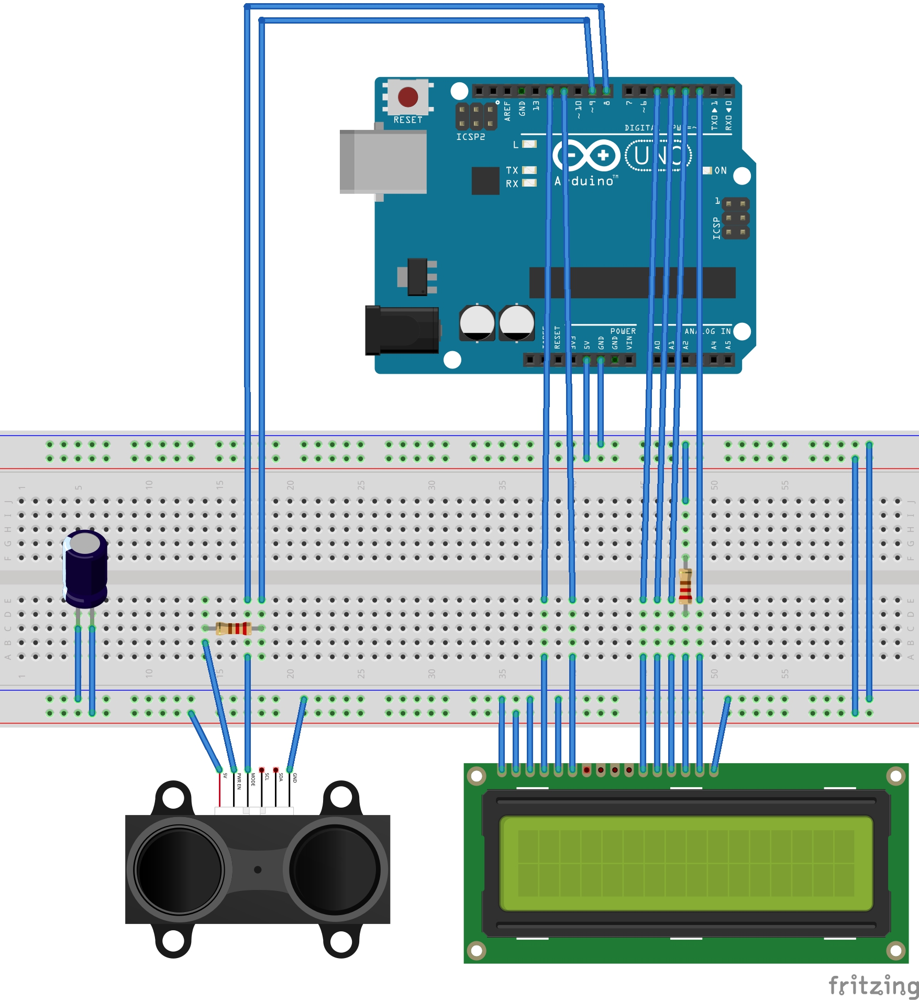

# Simple Range Finder

This is a simple range finder using the Lidar Lite v3 and a LCD display to show the distance the lidar is returning.  
The capacitor isn't totally needed, but is recommend by Garmin.  
The 1k Ohm Resistor is for the Lidar and the 220 Ohm Resistor is for the LCD display.  

---
### Part List:

- Arduino UNO (Rev.3)
- Garmin Lidar Lite v3
- LCD1602
- 220 Ohm Resistor
- 1k Ohm Resistor
- 680 μF capacitor

---
[Video](https://youtu.be/Um8i5tzrJPA)

---
##### Garmin Lidar Lit v3
https://buy.garmin.com/en-US/US/p/557294

##### Fritzing Part Diagram:
https://github.com/PulsedLight3D/LIDAR-Lite-Fritzing-Part

